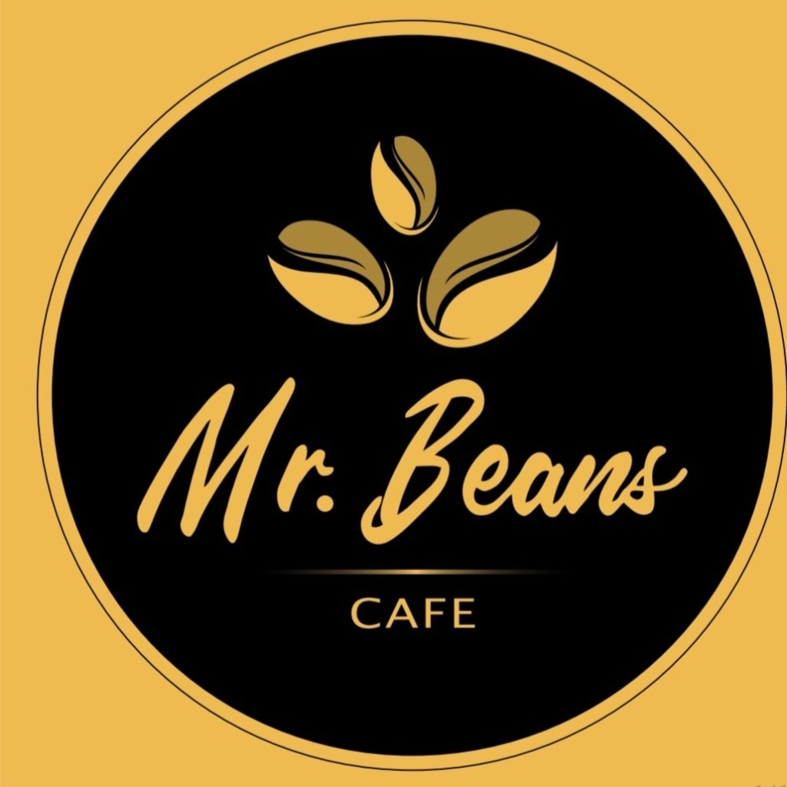

# Mr. Beans Cafe

A fully custom, high-performance web experience designed exclusively for **Mr. Beans Cafe**.

## Architecture & Technology

This repository contains the bespoke front-end application architecture for Mr. Beans, engineered from the ground up to deliver a premium, seamless digital experience. 

- **Custom 3D Rendering**: Engineered using advanced WebGL mathematics to continuously render a beautiful, 1:1 scale Mr. Beans takeaway cup in real-time.
- **Glassmorphic UI**: High-end translucent interaction design.
- **Performance Optimized**: Compiled and minified for instant mobile accessibility utilizing an ultra-fast modern asset bundler.
- **Responsive Fluid Grid**: Dynamically scales and reflows from large desktop monitors down to mobile viewports without breaking perspective.

## Deployment

This application is configured for robust Edge deployment. Content delivery is fully automated via continuous integration pipelines. It dynamically routes and serves optimized assets through edge edge nodes globally.

> **Designed and Developed by M Solution**
